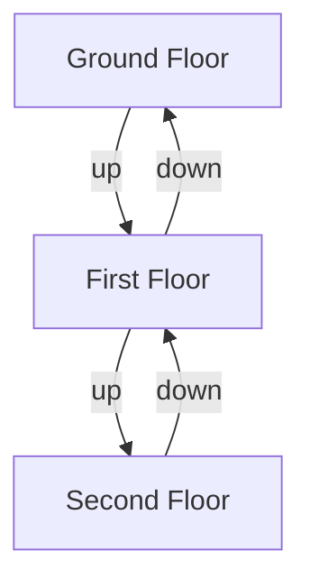
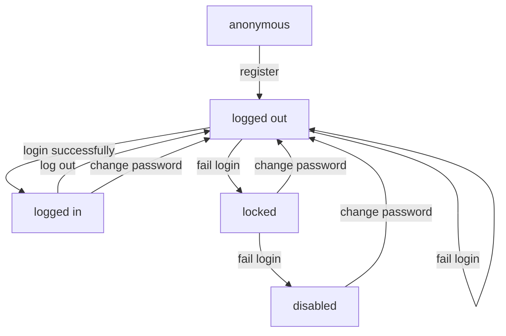

# State Machines

# what am it?

* a thing which is in only one state at a given time, 
* in response to some input it transitions to a new state
* a finite state machine can only transition to a finite (or countable/limited) number of states

# an example

an elevator is a state machine

# a bigger example

your user account is a state machine

You can use a state diagram to communicate and clarify

This is one of the ways that you can make a complicated thing out of little bits of code