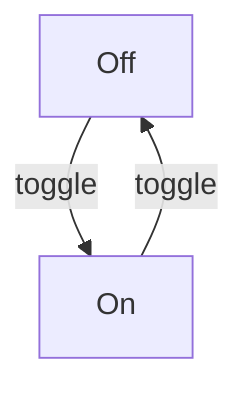
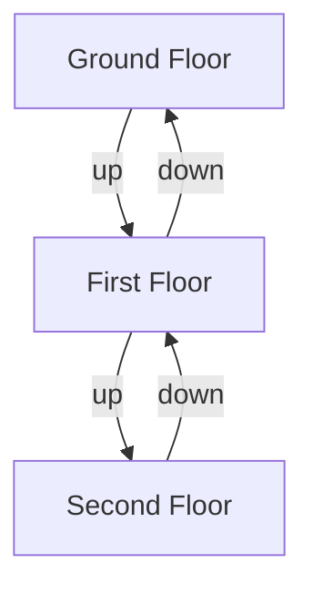
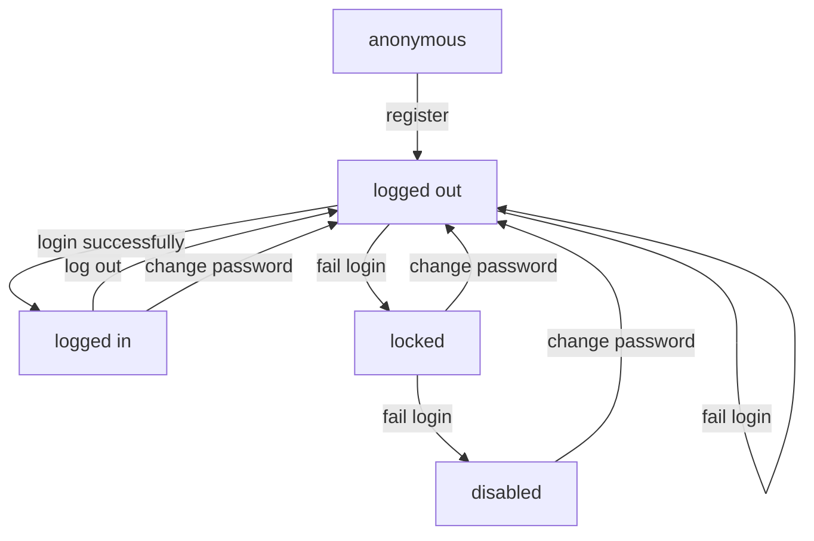

# State Machines

# what am it?

* a thing which is in only one state at a given time, 
* in response to some input it transitions to a new state
* a finite state machine can only transition to a finite (or countable/limited) number of states

Many systems have one of more state machines hidden inside them. That doesn't mean you _have_ to model the state machine. But if you never do you might be missing a trick.

This is one of the ways that you can make a complicated thing out of little bits of code. You can use a state diagram to communicate and clarify the system even if your code doesn't express the state machine directly.

# a very simple example

A switch is a state machine. It has two states: on and off. It has one transition between them: toggle

# an example

An elevator is a state machine. It has a state per floor. It has an up, and a down transition  (but not for every floor). If you press down when you're on the ground floor nothing will happen (hopefully)

# a bigger example

your user account is a state machine

# What are we going to do

### 1. Make a state machine
We'll test drive a state machine. But with some op